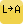

Label2Attr 0.1
==============

 

This plug-in helps to copy data from points/label texts to the attribute table of another layer. It was planned to use for filling attribute table of sewer network comming from CAD drawings where data are in text entities.

The plug-in was tested with Shape files but it should work with other editable vector formats, too. It was tested on Ubuntu and Windows 10 with QGIS 2.14 and 2.18.
This plug-in adds a toolbar and a menu option (into Plugins menu) to the QGIS user interface.

Usage
-----

You have to have a point layer and another vector layer in your actual project in QGIS. Turn on both layers. Add label to the point layer to see data to be copied to the attribute table of the other vector layer.

Click on the first (L->A) icon the set up the configuration. In the dialog you have to set some parameters:

+ Point Label Layer - select the name of your point layer you want to copy attribure from (only the visible layers are listed)
+ Label Column - select the attribute of the point layer to copy
+ Tolerance - the tolerance to find point when you click, it is in map units
+ Target Layer - select the name of the targetvector layer you want the attribute copy to  (only the visible layers are listed)
+ Target Column - select the attribute to to copy to

These setting are saved into the QGIS project, but you have to open this dialog after loading the project to fill the parameters from the project data.

After setting the parameters select a feature from the target vector layer then use the +A icon from the toolbar and click on the point to get the attribute. Repeat this to fill the attribute table.

Credits
-------

Label2Attr plug-in was developped by the [OSGeoLab Budapest](http://www.agt.bme.hu/osgeolab/index.php?page=start&lang=en) (member of the GeoForAll network) and it was financially supported by the local municipality of Budaörs, Hungary.
